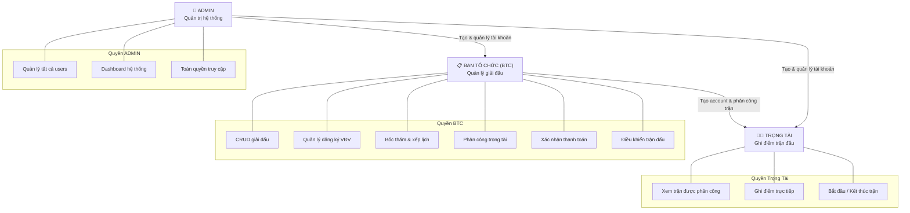
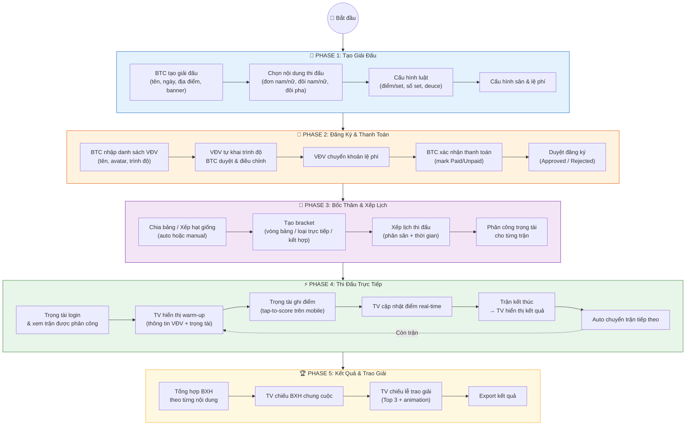
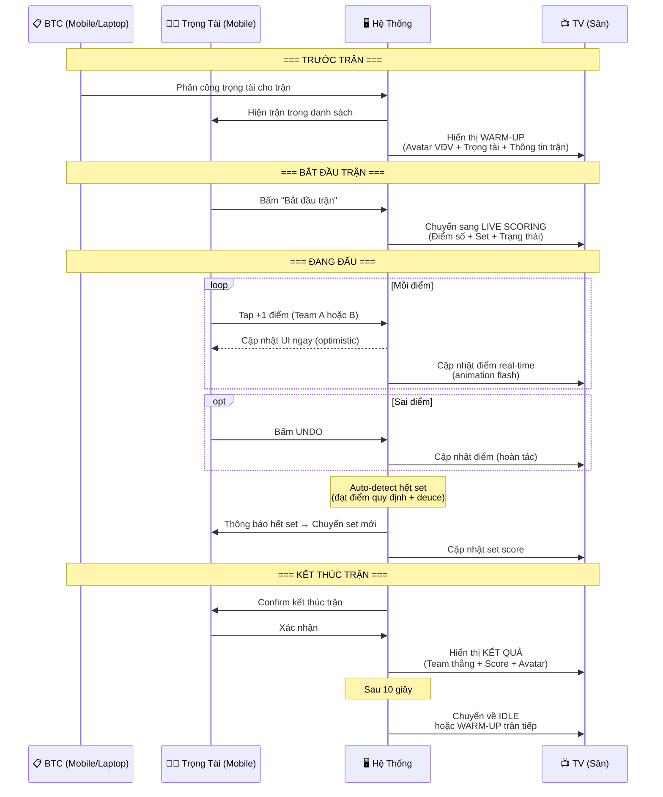
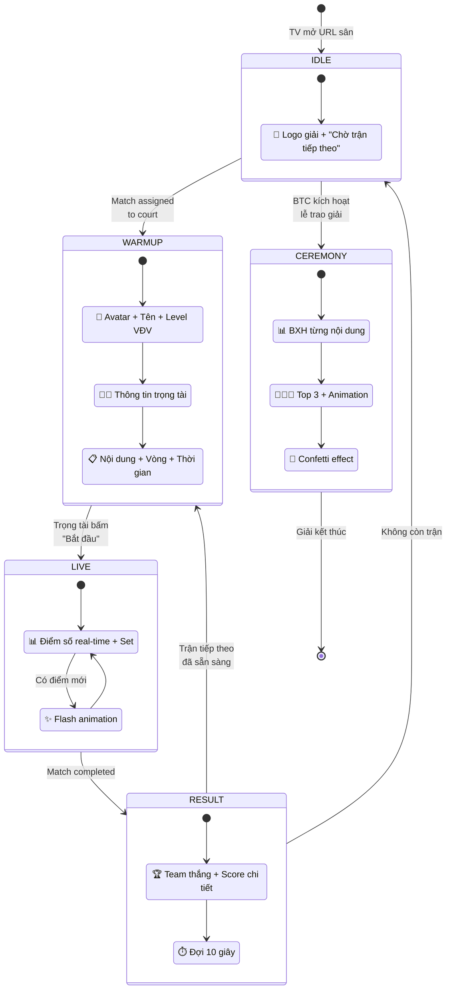
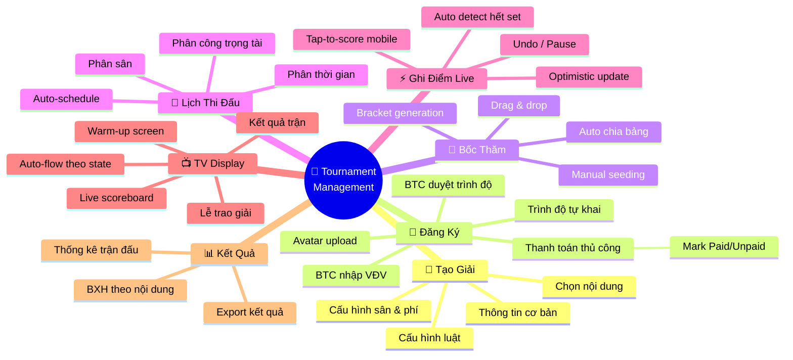
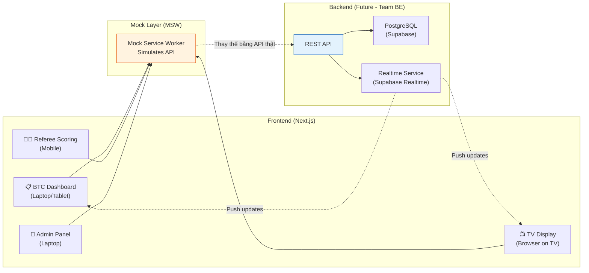
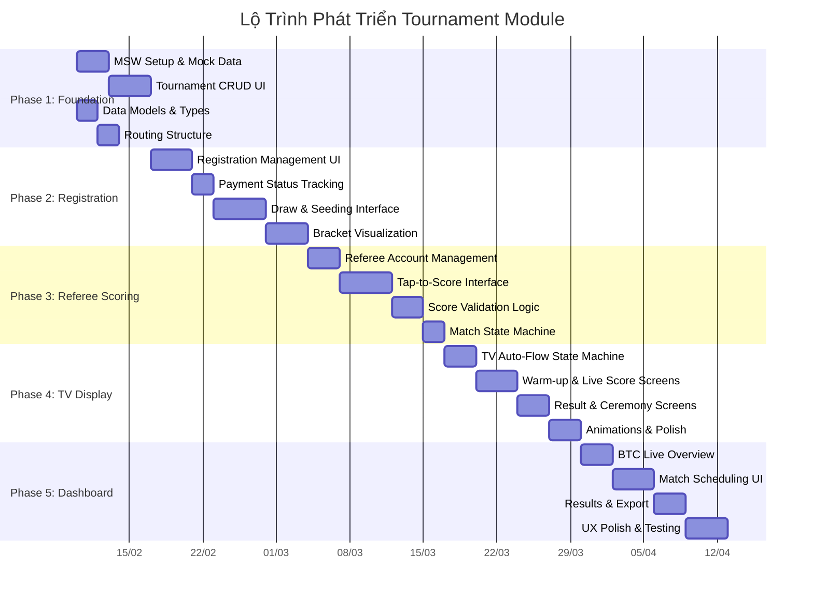

# Ventra Rocket Ranking — Tournament Management System
## Workflow Summary & Feature Overview

**Date:** 2026-02-04 | **Version:** 1.0 | **Status:** Proposal

---

## 1. Tổng Quan Hệ Thống

Mở rộng Ventra Rocket Ranking từ hệ thống quản lý trận đấu cầu lông casual thành **nền tảng tổ chức giải đấu chuyên nghiệp** với:
- Quản lý giải đấu đầy đủ (tạo giải, đăng ký, bốc thăm, lịch thi đấu)
- Ghi điểm trực tiếp trên mobile bởi trọng tài
- Trình chiếu điểm số real-time lên TV từng sân
- Hiển thị kết quả chung cuộc và lễ trao giải trên TV

**Quy mô mục tiêu:** ≤60 VĐV, 4 sân, 5 nội dung BWF

---

## 2. Roles & Permissions

---

## 3. Workflow Tổng Thể — Tổ Chức Giải Đấu

---

## 4. Workflow Chi Tiết — Ghi Điểm Trực Tiếp (Core Feature)

---

## 5. TV Display — State Machine

---

## 6. Tổng Quan Features

### 6.1 Nội Dung Thi Đấu (5 nội dung BWF)

| # | Nội Dung | Loại | Ghi Chú |
|---|----------|------|---------|
| 1 | Đơn Nam | Singles | 1v1 |
| 2 | Đơn Nữ | Singles | 1v1 |
| 3 | Đôi Nam | Doubles | 2v2, đăng ký theo cặp |
| 4 | Đôi Nữ | Doubles | 2v2, đăng ký theo cặp |
| 5 | Đôi Nam Nữ | Mixed Doubles | 2v2, đăng ký theo cặp |

### 6.2 Thể Thức Hỗ Trợ

| Thể Thức | Mô Tả | Phù Hợp |
|-----------|--------|----------|
| Vòng bảng (Round Robin) | Mọi đội trong bảng đấu nhau | Giải phong trào, ít đội |
| Loại trực tiếp (Single Elimination) | Thua = bị loại | Giải lớn, nhanh gọn |
| Kết hợp (Group + Knockout) | Vòng bảng → Vòng loại trực tiếp | Phổ biến nhất |

### 6.3 Luật Tính Điểm (Tùy Chỉnh)

| Cấu Hình | Tùy Chọn | Mặc Định |
|-----------|----------|----------|
| Điểm / set | 11, 15, 21 | 21 (BWF) |
| Số set | 1, 3, 5 | 3 (Best of 3) |
| Deuce | Bật / Tắt | Bật |
| Điểm tối đa (deuce) | 25, 30, không giới hạn | 30 (BWF) |

### 6.4 Feature Map

---

## 7. Kiến Trúc Kỹ Thuật (High-Level)

---

## 8. Lộ Trình Phát Triển

---

## 9. Tóm Tắt Cho Lãnh Đạo

| Hạng Mục | Chi Tiết |
|-----------|----------|
| **Mục tiêu** | Nền tảng tổ chức giải cầu lông chuyên nghiệp, real-time |
| **Quy mô** | ≤60 VĐV, 4 sân, 5 nội dung BWF |
| **Thể thức** | Vòng bảng, loại trực tiếp, hoặc kết hợp (tùy chỉnh) |
| **Highlight** | Ghi điểm mobile (tap-to-score) + TV scoreboard real-time |
| **Approach** | FE-first với mock data → BE team build API sau |
| **Ngôn ngữ** | Tiếng Việt (MVP), có thể mở rộng đa ngôn ngữ cho SaaS |
| **Thanh toán** | Thủ công (chuyển khoản → BTC xác nhận), auto payment phase sau |
| **Tiềm năng** | Sản phẩm nội bộ → SaaS cho các CLB/giải cầu lông toàn quốc |

---

*Ventra Rocket Ranking — Tournament Management System Proposal v1.0*
